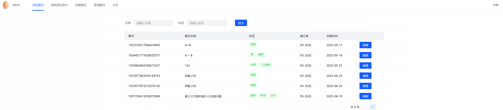
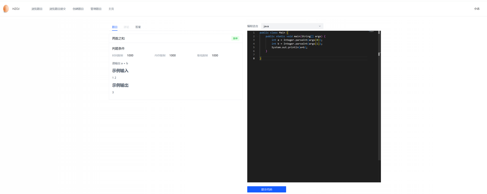
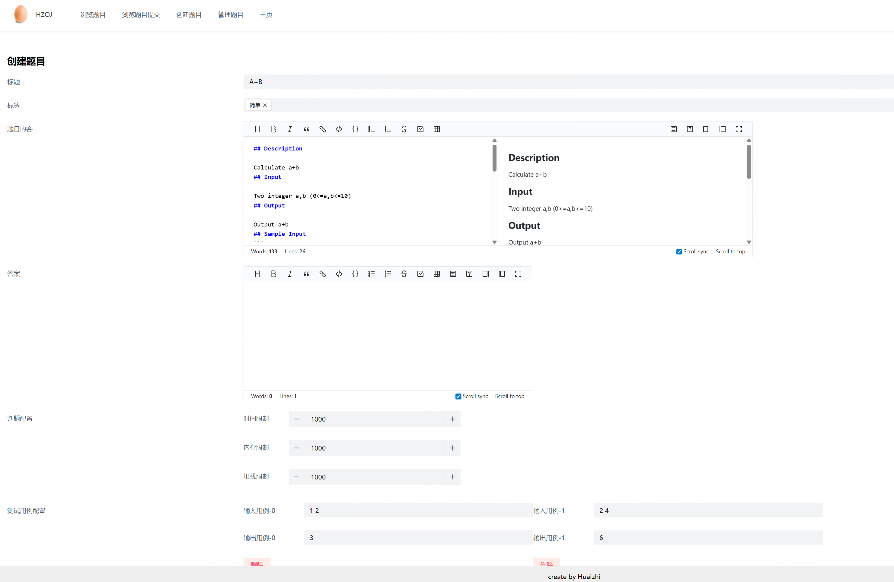
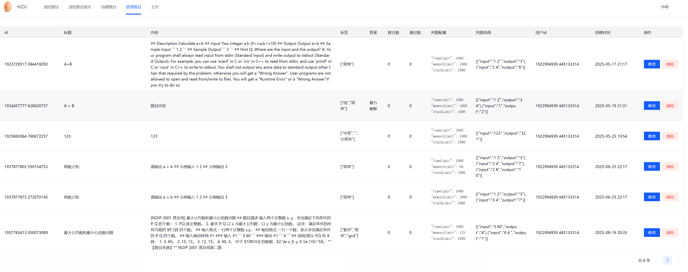
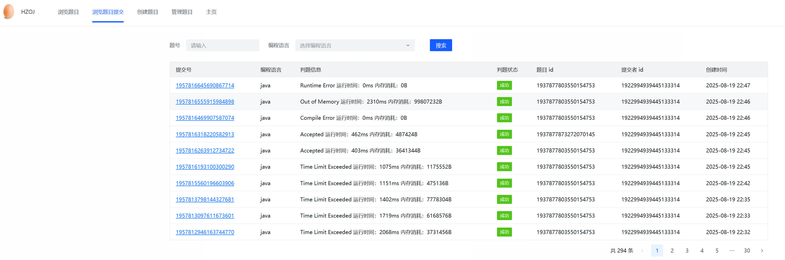
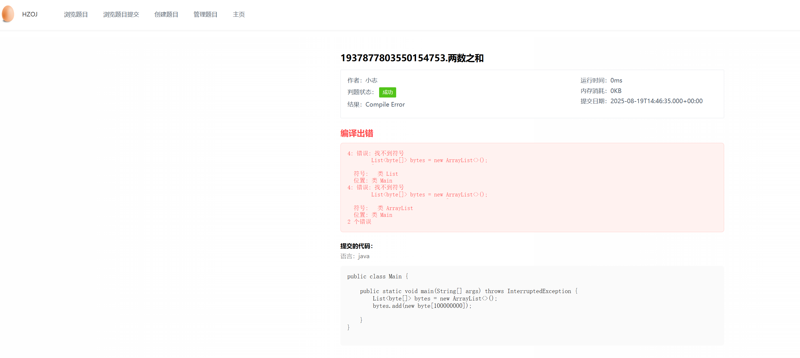
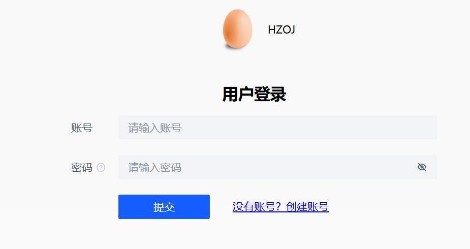
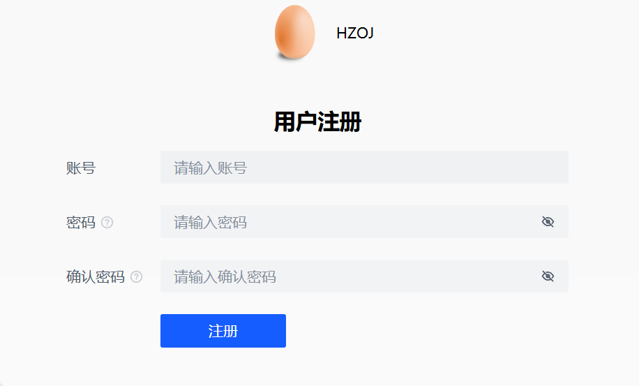

# OJ判题项目前端
前端才用Vue框架 + ArcoDesign组件
在市面星球上的项目的基础上进行了扩展开发，主要通过Cusror进行辅助开发
## 主页/浏览题目页面

## 做题页面

## 创建题目页面

## 题目管理页面
在项目原有页面的基础上

## 提交信息页面
在原有项目的基础上，对提交信息的呈现进行了优化，目前支持五种类型的判题结果：
Accept / Wrong answer / Time Limit Exceeded / Out of Memory / Runtime Error

## 提交详情页面
新开发页，能够根据用户的权限查看用户的提交代码及判题信息（用户只能查看自己提交的代码，管理员能够查看所有的提交代码。

如果用户提交的代码出现编译报错，可以显示编译报错的信息。

## 登录页面

## 注册界面
在原有项目的基础上增加了注册页面

